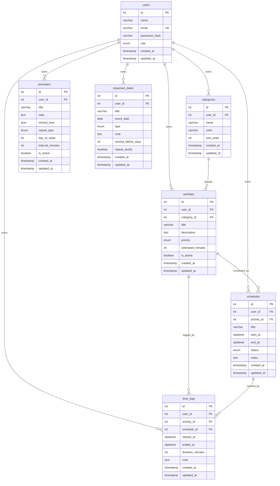

# Mô tả cơ sở dữ liệu

## 1. Thông tin chung

- Tên cơ sở dữ liệu: `personal_time_optimizer`
- Hệ quản trị: MySQL/MariaDB
- Bảng mã: `utf8mb4`
- Collation: `utf8mb4_unicode_ci`
- Engine chính: `InnoDB`

Cơ sở dữ liệu được thiết kế để lưu dữ liệu quản lý thời gian cá nhân theo từng tài khoản người dùng. Các bảng chính gồm người dùng, danh mục, hoạt động, lịch, nhắc nhở, ngày quan trọng và nhật ký thời gian.

## 2. Danh sách bảng

| STT | Tên bảng | Mục đích |
|---|---|---|
| 1 | `users` | Lưu thông tin tài khoản người dùng. |
| 2 | `categories` | Lưu danh mục phân loại hoạt động. |
| 3 | `activities` | Lưu hoạt động cá nhân của người dùng. |
| 4 | `schedules` | Lưu lịch trình được tạo từ hoạt động. |
| 5 | `reminders` | Lưu nhắc nhở của người dùng. |
| 6 | `important_dates` | Lưu các ngày quan trọng. |
| 7 | `time_logs` | Lưu dữ liệu nhật ký thời gian và báo cáo. |

## 3. Mô tả từng bảng

### 3.1. Bảng `users`

Mục đích: Lưu thông tin tài khoản đăng nhập và phân loại vai trò người dùng.

| Trường | Kiểu dữ liệu | Mô tả |
|---|---|---|
| `id` | `INT UNSIGNED AUTO_INCREMENT` | Mã người dùng. |
| `name` | `VARCHAR(100)` | Họ tên người dùng. |
| `email` | `VARCHAR(150)` | Email đăng nhập. |
| `password_hash` | `VARCHAR(255)` | Mật khẩu đã băm. |
| `role` | `ENUM('demo', 'user')` | Vai trò tài khoản. |
| `created_at` | `TIMESTAMP` | Thời điểm tạo. |
| `updated_at` | `TIMESTAMP` | Thời điểm cập nhật gần nhất. |

- Khóa chính: `id`
- Ràng buộc quan trọng:
  - `email` là duy nhất.
  - `role` mặc định là `user`.

### 3.2. Bảng `categories`

Mục đích: Lưu các danh mục để phân loại hoạt động theo từng người dùng.

| Trường | Kiểu dữ liệu | Mô tả |
|---|---|---|
| `id` | `INT UNSIGNED AUTO_INCREMENT` | Mã danh mục. |
| `user_id` | `INT UNSIGNED` | Người dùng sở hữu danh mục. |
| `name` | `VARCHAR(100)` | Tên danh mục. |
| `color` | `VARCHAR(20)` | Màu đại diện. |
| `sort_order` | `INT UNSIGNED` | Thứ tự sắp xếp. |
| `created_at` | `TIMESTAMP` | Thời điểm tạo. |
| `updated_at` | `TIMESTAMP` | Thời điểm cập nhật gần nhất. |

- Khóa chính: `id`
- Khóa ngoại:
  - `user_id` tham chiếu `users(id)` với `ON DELETE CASCADE`.
- Ràng buộc quan trọng:
  - `UNIQUE (user_id, name)` giúp một người dùng không tạo hai danh mục cùng tên.
  - `color` mặc định là `#2563eb`.
  - `sort_order` mặc định là `0`.

### 3.3. Bảng `activities`

Mục đích: Lưu các hoạt động cá nhân mà người dùng muốn quản lý hoặc đưa vào lịch.

| Trường | Kiểu dữ liệu | Mô tả |
|---|---|---|
| `id` | `INT UNSIGNED AUTO_INCREMENT` | Mã hoạt động. |
| `user_id` | `INT UNSIGNED` | Người dùng sở hữu hoạt động. |
| `category_id` | `INT UNSIGNED` | Danh mục của hoạt động. |
| `title` | `VARCHAR(150)` | Tên hoạt động. |
| `description` | `TEXT NULL` | Mô tả hoạt động. |
| `priority` | `ENUM('low', 'medium', 'high')` | Mức ưu tiên. |
| `estimated_minutes` | `INT UNSIGNED` | Thời lượng ước tính. |
| `is_active` | `TINYINT(1)` | Trạng thái hoạt động. |
| `created_at` | `TIMESTAMP` | Thời điểm tạo. |
| `updated_at` | `TIMESTAMP` | Thời điểm cập nhật gần nhất. |

- Khóa chính: `id`
- Khóa ngoại:
  - `user_id` tham chiếu `users(id)` với `ON DELETE CASCADE`.
  - `category_id` tham chiếu `categories(id)` với `ON DELETE RESTRICT`.
- Ràng buộc quan trọng:
  - `priority` mặc định là `medium`.
  - `estimated_minutes` mặc định là `30`.
  - `is_active` mặc định là `1`.
  - Không cho xóa danh mục nếu còn hoạt động đang tham chiếu.

### 3.4. Bảng `schedules`

Mục đích: Lưu lịch trình cụ thể của các hoạt động.

| Trường | Kiểu dữ liệu | Mô tả |
|---|---|---|
| `id` | `INT UNSIGNED AUTO_INCREMENT` | Mã lịch. |
| `user_id` | `INT UNSIGNED` | Người dùng sở hữu lịch. |
| `activity_id` | `INT UNSIGNED` | Hoạt động được lên lịch. |
| `title` | `VARCHAR(150)` | Tiêu đề lịch. |
| `start_at` | `DATETIME` | Thời gian bắt đầu kế hoạch. |
| `end_at` | `DATETIME` | Thời gian kết thúc kế hoạch. |
| `status` | `ENUM('scheduled', 'completed', 'cancelled')` | Trạng thái lưu trữ của lịch. |
| `notes` | `TEXT NULL` | Ghi chú. |
| `created_at` | `TIMESTAMP` | Thời điểm tạo. |
| `updated_at` | `TIMESTAMP` | Thời điểm cập nhật gần nhất. |

- Khóa chính: `id`
- Khóa ngoại:
  - `user_id` tham chiếu `users(id)` với `ON DELETE CASCADE`.
  - `activity_id` tham chiếu `activities(id)` với `ON DELETE RESTRICT`.
- Ràng buộc quan trọng:
  - `status` mặc định là `scheduled`.
  - Có chỉ mục `idx_schedules_user_start (user_id, start_at)` để phục vụ lọc theo ngày.
  - Không cho xóa hoạt động nếu còn lịch tham chiếu.
- Ghi chú nghiệp vụ:
  - Trạng thái hiển thị của lịch được tính theo thời gian hiện tại: Đã ghi nhận, Đang thực hiện, Đã hoàn thành hoặc Đã hủy.
  - Trạng thái hiển thị có thể khác với giá trị lưu trong cột `status`.

### 3.5. Bảng `reminders`

Mục đích: Lưu nhắc nhở cá nhân và quy tắc lặp.

| Trường | Kiểu dữ liệu | Mô tả |
|---|---|---|
| `id` | `INT UNSIGNED AUTO_INCREMENT` | Mã nhắc nhở. |
| `user_id` | `INT UNSIGNED` | Người dùng sở hữu nhắc nhở. |
| `title` | `VARCHAR(150)` | Tiêu đề nhắc nhở. |
| `note` | `TEXT NULL` | Nội dung ghi chú. |
| `remind_time` | `TIME` | Giờ nhắc. |
| `repeat_type` | `ENUM('none', 'daily', 'weekly', 'interval')` | Kiểu lặp. |
| `day_of_week` | `TINYINT UNSIGNED NULL` | Ngày trong tuần khi lặp hằng tuần. |
| `interval_minutes` | `INT UNSIGNED NULL` | Khoảng lặp tính bằng phút. |
| `is_active` | `TINYINT(1)` | Trạng thái bật/tắt. |
| `created_at` | `TIMESTAMP` | Thời điểm tạo. |
| `updated_at` | `TIMESTAMP` | Thời điểm cập nhật gần nhất. |

- Khóa chính: `id`
- Khóa ngoại:
  - `user_id` tham chiếu `users(id)` với `ON DELETE CASCADE`.
- Ràng buộc quan trọng:
  - `repeat_type` mặc định là `none`.
  - `is_active` mặc định là `1`.
  - Có chỉ mục theo người dùng, giờ nhắc và trạng thái hoạt động.

### 3.6. Bảng `important_dates`

Mục đích: Lưu các mốc ngày quan trọng như sinh nhật, kỳ thi, hạn chót hoặc ngày kỷ niệm.

| Trường | Kiểu dữ liệu | Mô tả |
|---|---|---|
| `id` | `INT UNSIGNED AUTO_INCREMENT` | Mã ngày quan trọng. |
| `user_id` | `INT UNSIGNED` | Người dùng sở hữu dữ liệu. |
| `title` | `VARCHAR(180)` | Tên sự kiện. |
| `event_date` | `DATE` | Ngày diễn ra. |
| `type` | `ENUM('holiday', 'travel', 'date', 'anniversary', 'deadline', 'birthday', 'exam', 'other')` | Loại sự kiện. |
| `note` | `TEXT NULL` | Ghi chú. |
| `remind_before_days` | `INT UNSIGNED` | Số ngày nhắc trước. |
| `repeat_yearly` | `TINYINT(1)` | Có lặp hằng năm hay không. |
| `created_at` | `TIMESTAMP` | Thời điểm tạo. |
| `updated_at` | `TIMESTAMP` | Thời điểm cập nhật gần nhất. |

- Khóa chính: `id`
- Khóa ngoại:
  - `user_id` tham chiếu `users(id)` với `ON DELETE CASCADE`.
- Ràng buộc quan trọng:
  - `type` mặc định là `other`.
  - `remind_before_days` mặc định là `7`.
  - `repeat_yearly` mặc định là `0`.
  - Có chỉ mục theo ngày và loại sự kiện.

### 3.7. Bảng `time_logs`

Mục đích: Lưu dữ liệu nhật ký thời gian và phục vụ báo cáo theo ngày.

| Trường | Kiểu dữ liệu | Mô tả |
|---|---|---|
| `id` | `INT UNSIGNED AUTO_INCREMENT` | Mã nhật ký. |
| `user_id` | `INT UNSIGNED` | Người dùng sở hữu nhật ký. |
| `activity_id` | `INT UNSIGNED NULL` | Hoạt động liên quan, có thể rỗng khi hoạt động đã bị xóa. |
| `schedule_id` | `INT UNSIGNED NULL` | Lịch liên quan, có thể rỗng khi lịch đã bị xóa. |
| `started_at` | `DATETIME` | Thời gian bắt đầu ghi nhận. |
| `ended_at` | `DATETIME` | Thời gian kết thúc ghi nhận. |
| `duration_minutes` | `INT UNSIGNED` | Thời lượng tính bằng phút. |
| `note` | `TEXT NULL` | Ghi chú. |
| `created_at` | `TIMESTAMP` | Thời điểm tạo. |
| `updated_at` | `TIMESTAMP` | Thời điểm cập nhật gần nhất. |

- Khóa chính: `id`
- Khóa ngoại:
  - `user_id` tham chiếu `users(id)` với `ON DELETE CASCADE`.
  - `activity_id` tham chiếu `activities(id)` với `ON DELETE SET NULL`.
  - `schedule_id` tham chiếu `schedules(id)` với `ON DELETE SET NULL`.
- Ràng buộc quan trọng:
  - `activity_id` và `schedule_id` cho phép rỗng để giữ lại lịch sử báo cáo khi dữ liệu liên quan bị xóa.
  - Có chỉ mục `idx_time_logs_user_started (user_id, started_at)` để phục vụ báo cáo theo ngày.

## 4. Tóm tắt quan hệ dữ liệu

- Một người dùng có nhiều danh mục.
- Một người dùng có nhiều hoạt động.
- Một danh mục có nhiều hoạt động.
- Một hoạt động có thể có nhiều lịch.
- Một người dùng có nhiều nhắc nhở.
- Một người dùng có nhiều ngày quan trọng.
- Một người dùng có nhiều nhật ký thời gian.
- Một nhật ký thời gian có thể liên kết với một hoạt động và một lịch.
- Khi xóa người dùng, các dữ liệu phụ thuộc bị xóa theo do `ON DELETE CASCADE`.
- Khi xóa hoạt động hoặc lịch có liên quan đến nhật ký thời gian, nhật ký được giữ lại và trường liên kết được đặt thành `NULL`.
- Khi xóa danh mục hoặc hoạt động đang được dữ liệu khác sử dụng theo ràng buộc `RESTRICT`, cơ sở dữ liệu sẽ không cho xóa trực tiếp.

## 5. Sơ đồ ERD gợi ý

## 6. Ghi chú về xóa dữ liệu

| Quan hệ | Hành vi khi xóa |
|---|---|
| `categories.user_id -> users.id` | Xóa người dùng sẽ xóa danh mục tương ứng. |
| `activities.user_id -> users.id` | Xóa người dùng sẽ xóa hoạt động tương ứng. |
| `activities.category_id -> categories.id` | Không cho xóa danh mục nếu còn hoạt động sử dụng. |
| `schedules.user_id -> users.id` | Xóa người dùng sẽ xóa lịch tương ứng. |
| `schedules.activity_id -> activities.id` | Không cho xóa hoạt động nếu còn lịch sử dụng. |
| `reminders.user_id -> users.id` | Xóa người dùng sẽ xóa nhắc nhở tương ứng. |
| `important_dates.user_id -> users.id` | Xóa người dùng sẽ xóa ngày quan trọng tương ứng. |
| `time_logs.user_id -> users.id` | Xóa người dùng sẽ xóa nhật ký thời gian tương ứng. |
| `time_logs.activity_id -> activities.id` | Xóa hoạt động sẽ đặt `activity_id` trong nhật ký thành `NULL`. |
| `time_logs.schedule_id -> schedules.id` | Xóa lịch sẽ đặt `schedule_id` trong nhật ký thành `NULL`. |
