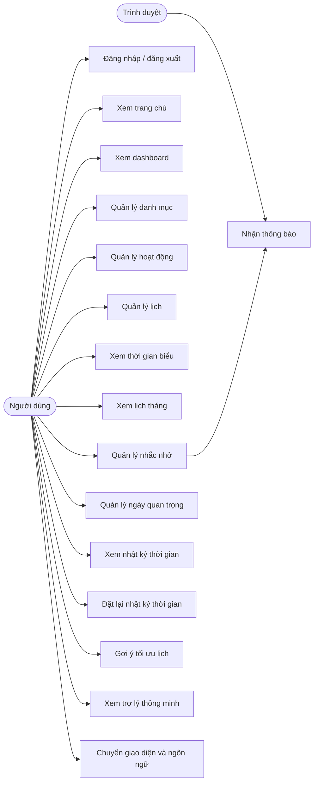

# Phân tích hệ thống

## 1. Giới thiệu bài toán

URTISYNC - Hệ thống tối ưu hóa quản lý thời gian cá nhân được xây dựng nhằm hỗ trợ người dùng theo dõi, sắp xếp và cải thiện cách sử dụng thời gian hằng ngày. Trong thực tế, người dùng thường có nhiều hoạt động khác nhau như học tập, làm việc, nghỉ ngơi, nhắc nhở cá nhân và các mốc ngày quan trọng. Nếu không có công cụ quản lý tập trung, lịch trình dễ bị chồng chéo, bỏ sót hoặc khó đánh giá hiệu quả thực hiện.

Hệ thống cung cấp một môi trường web giúp người dùng quản lý danh mục, hoạt động, lịch, thời gian biểu, nhắc nhở, ngày quan trọng và nhật ký thời gian. Ngoài ra, hệ thống còn hỗ trợ gợi ý khoảng trống phù hợp để người dùng chủ động tối ưu lịch cá nhân.

## 2. Mục tiêu hệ thống

- Hỗ trợ người dùng lập kế hoạch thời gian theo ngày, tuần và tháng.
- Quản lý hoạt động theo danh mục để dễ phân loại công việc.
- Theo dõi lịch trình và trạng thái lịch theo thời gian thực.
- Cung cấp thời gian biểu theo ngày để người dùng kiểm tra các hoạt động trong ngày.
- Quản lý nhắc nhở định kỳ theo ngày, theo tuần hoặc theo khoảng thời gian.
- Ghi nhận và hiển thị nhật ký thời gian dưới dạng báo cáo.
- Đưa ra gợi ý khoảng thời gian trống dựa trên lịch đã có.
- Cung cấp dashboard tổng quan để theo dõi kế hoạch, thời lượng và mức độ cân bằng.
- Hỗ trợ giao diện sáng/tối và chuyển đổi ngôn ngữ Việt/Anh.

## 3. Đối tượng sử dụng

- Sinh viên cần quản lý thời gian học tập, làm bài tập, ôn thi và sinh hoạt cá nhân.
- Người đi làm muốn theo dõi công việc, cuộc hẹn, nhắc nhở và lịch cá nhân.
- Người dùng cá nhân có nhu cầu lập kế hoạch và cải thiện thói quen sử dụng thời gian.

## 4. Phạm vi hệ thống

Hệ thống tập trung vào quản lý thời gian cá nhân cho từng tài khoản người dùng. Dữ liệu của mỗi người dùng được tách biệt theo tài khoản đăng nhập.

Các chức năng nằm trong phạm vi:

- Đăng nhập, đăng xuất và truy cập tài khoản.
- Trang chủ hiển thị nội dung định hướng thói quen cá nhân.
- Dashboard tổng quan lịch trình, thời lượng và trạng thái.
- Quản lý danh mục và hoạt động.
- Quản lý lịch, lọc lịch theo ngày và xem lịch tháng.
- Xem thời gian biểu theo ngày.
- Quản lý nhắc nhở và thông báo trình duyệt.
- Quản lý ngày quan trọng.
- Xem và đặt lại nhật ký thời gian.
- Gợi ý tối ưu khoảng trống trong lịch.
- Trợ lý thông minh đưa ra nhận xét dựa trên dữ liệu hiện có.
- Tùy chỉnh giao diện sáng/tối, mật độ hiển thị, màu nhấn và ngôn ngữ.

Các nội dung ngoài phạm vi:

- Quản lý nhóm hoặc chia sẻ lịch giữa nhiều người dùng.
- Đồng bộ với lịch bên ngoài như Google Calendar.
- Thanh toán trực tuyến.
- Ứng dụng di động độc lập.

## 5. Nghiệp vụ chính

1. Người dùng đăng nhập vào hệ thống.
2. Người dùng tạo danh mục để phân nhóm hoạt động.
3. Người dùng tạo hoạt động với tên, mô tả, mức ưu tiên và thời lượng ước tính.
4. Người dùng tạo lịch cho hoạt động theo thời gian bắt đầu và kết thúc.
5. Hệ thống tự xác định trạng thái hiển thị của lịch theo thời gian hiện tại.
6. Người dùng xem lịch theo danh sách, theo ngày, theo thời gian biểu hoặc theo lịch tháng.
7. Người dùng tạo nhắc nhở để nhận thông báo đúng thời điểm.
8. Người dùng lưu các ngày quan trọng và số ngày nhắc trước.
9. Người dùng xem nhật ký thời gian để đối chiếu kế hoạch trong ngày.
10. Người dùng đặt lại nhật ký thời gian khi cần làm sạch dữ liệu báo cáo.
11. Người dùng nhập nhu cầu để hệ thống gợi ý khoảng trống phù hợp.
12. Người dùng xem dashboard và trợ lý thông minh để nhận tổng quan và khuyến nghị.

## 6. Các tác nhân

| Tác nhân | Vai trò |
|---|---|
| Người dùng | Đăng nhập, quản lý dữ liệu cá nhân, xem báo cáo và sử dụng các chức năng tối ưu thời gian. |
| Hệ thống | Lưu trữ dữ liệu, xử lý nghiệp vụ, xác định trạng thái lịch, tạo báo cáo và gợi ý. |
| Trình duyệt | Hiển thị giao diện, lưu tùy chọn giao diện và phát thông báo khi người dùng cho phép. |

## 7. Danh sách use case

| Mã use case | Tên use case | Tác nhân chính |
|---|---|---|
| UC-01 | Đăng nhập | Người dùng |
| UC-02 | Đăng xuất | Người dùng |
| UC-03 | Xem trang chủ | Người dùng |
| UC-04 | Xem dashboard | Người dùng |
| UC-05 | Quản lý danh mục | Người dùng |
| UC-06 | Quản lý hoạt động | Người dùng |
| UC-07 | Quản lý lịch | Người dùng |
| UC-08 | Xem thời gian biểu | Người dùng |
| UC-09 | Xem lịch tháng | Người dùng |
| UC-10 | Quản lý nhắc nhở | Người dùng |
| UC-11 | Bật/tắt thông báo trình duyệt | Người dùng |
| UC-12 | Quản lý ngày quan trọng | Người dùng |
| UC-13 | Xem nhật ký thời gian | Người dùng |
| UC-14 | Đặt lại nhật ký thời gian | Người dùng |
| UC-15 | Gợi ý tối ưu lịch | Người dùng |
| UC-16 | Xem trợ lý thông minh | Người dùng |
| UC-17 | Chuyển giao diện sáng/tối | Người dùng |
| UC-18 | Chuyển ngôn ngữ VI/EN | Người dùng |

## 8. Mô tả use case chính

### 8.1. UC-01 - Đăng nhập

- Mục tiêu: Cho phép người dùng truy cập hệ thống bằng tài khoản hợp lệ.
- Điều kiện trước: Người dùng chưa đăng nhập.
- Luồng chính:
  1. Người dùng mở trang đăng nhập.
  2. Người dùng nhập email và mật khẩu.
  3. Hệ thống kiểm tra thông tin đăng nhập.
  4. Nếu hợp lệ, hệ thống tạo phiên đăng nhập và chuyển vào giao diện chính.
- Luồng thay thế:
  - Nếu thông tin không hợp lệ, hệ thống hiển thị thông báo lỗi.
- Kết quả: Người dùng được truy cập các chức năng sau khi đăng nhập.

### 8.2. UC-05 - Quản lý danh mục

- Mục tiêu: Cho phép người dùng phân nhóm hoạt động theo danh mục.
- Luồng chính:
  1. Người dùng mở trang danh mục.
  2. Người dùng thêm danh mục với tên, màu sắc và thứ tự sắp xếp.
  3. Người dùng có thể sửa hoặc xóa danh mục.
  4. Hệ thống lưu dữ liệu theo tài khoản hiện tại.
- Ràng buộc:
  - Tên danh mục không được trùng trong cùng một tài khoản.
  - Danh mục đang được hoạt động sử dụng không thể bị xóa do ràng buộc dữ liệu.

### 8.3. UC-06 - Quản lý hoạt động

- Mục tiêu: Quản lý các hoạt động cá nhân cần lên lịch hoặc theo dõi.
- Luồng chính:
  1. Người dùng tạo hoạt động và chọn danh mục.
  2. Người dùng nhập tên, mô tả, mức ưu tiên, thời lượng ước tính và trạng thái hoạt động.
  3. Người dùng có thể sửa hoặc xóa hoạt động.
- Ràng buộc:
  - Hoạt động phải thuộc một danh mục hợp lệ.
  - Nếu hoạt động còn lịch liên quan, hệ thống không cho xóa để tránh phá vỡ lịch.
  - Nếu hoạt động có nhật ký thời gian, hệ thống giữ lại lịch sử bằng cách tách liên kết hoạt động khỏi nhật ký.

### 8.4. UC-07 - Quản lý lịch

- Mục tiêu: Tạo và quản lý lịch trình cho các hoạt động.
- Luồng chính:
  1. Người dùng mở trang lịch.
  2. Người dùng chọn ngày xem hoặc chọn tất cả ngày.
  3. Người dùng thêm lịch cho một hoạt động.
  4. Người dùng nhập tiêu đề, thời gian bắt đầu, thời gian kết thúc, trạng thái lưu trữ và ghi chú.
  5. Người dùng có thể sửa hoặc xóa lịch.
- Quy tắc trạng thái hiển thị:
  - Nếu lịch bị hủy, hiển thị "Đã hủy".
  - Nếu hiện tại trước thời gian bắt đầu, hiển thị "Đã ghi nhận".
  - Nếu hiện tại nằm trong khoảng bắt đầu đến kết thúc, hiển thị "Đang thực hiện".
  - Nếu hiện tại sau thời gian kết thúc, hiển thị "Đã hoàn thành".

### 8.5. UC-08 - Xem thời gian biểu

- Mục tiêu: Hiển thị lịch trình trong ngày theo dạng thời gian biểu.
- Luồng chính:
  1. Người dùng chọn ngày cần xem.
  2. Hệ thống lấy các lịch trong ngày.
  3. Hệ thống hiển thị hoạt động, thời gian, danh mục, ghi chú và trạng thái.
  4. Người dùng có thể thêm hoặc xóa mục lịch từ trang thời gian biểu.
- Kết quả: Người dùng dễ kiểm tra thứ tự công việc trong ngày.

### 8.6. UC-10 - Quản lý nhắc nhở

- Mục tiêu: Giúp người dùng không bỏ sót các việc cần nhớ.
- Luồng chính:
  1. Người dùng tạo nhắc nhở.
  2. Người dùng nhập tiêu đề, nội dung, giờ nhắc và kiểu lặp.
  3. Hệ thống hỗ trợ kiểu không lặp, hằng ngày, hằng tuần và theo khoảng thời gian.
  4. Người dùng có thể bật/tắt, sửa hoặc xóa nhắc nhở.
- Kết quả: Nhắc nhở được hiển thị trong hệ thống và có thể dùng để phát thông báo trình duyệt.

### 8.7. UC-12 - Quản lý ngày quan trọng

- Mục tiêu: Lưu trữ các mốc ngày quan trọng của người dùng.
- Luồng chính:
  1. Người dùng thêm ngày quan trọng.
  2. Người dùng nhập tiêu đề, ngày diễn ra, loại sự kiện, ghi chú, số ngày nhắc trước và tùy chọn lặp hằng năm.
  3. Người dùng có thể sửa hoặc xóa ngày quan trọng.
- Kết quả: Các ngày quan trọng được hiển thị trong danh sách và lịch tháng.

### 8.8. UC-13 - Xem nhật ký thời gian

- Mục tiêu: Hiển thị báo cáo thời gian theo ngày.
- Luồng chính:
  1. Người dùng mở trang nhật ký thời gian.
  2. Người dùng chọn ngày cần xem.
  3. Hệ thống hiển thị hoạt động, danh mục, thời gian kế hoạch, thời lượng kế hoạch và ghi chú.
  4. Hệ thống vẫn hiển thị an toàn khi hoạt động hoặc danh mục liên quan đã bị xóa.
- Kết quả: Người dùng có báo cáo đơn giản để kiểm tra lịch sử thời gian.

### 8.9. UC-15 - Gợi ý tối ưu lịch

- Mục tiêu: Tìm khoảng thời gian trống phù hợp để sắp xếp hoạt động.
- Luồng chính:
  1. Người dùng chọn hoạt động cần sắp lịch.
  2. Người dùng nhập khoảng ngày, thời lượng cần tìm, giờ bắt đầu sớm nhất và giờ kết thúc muộn nhất.
  3. Hệ thống so sánh với các lịch bận hiện có.
  4. Hệ thống trả về các khoảng trống phù hợp kèm điểm ưu tiên.
  5. Người dùng có thể tạo lịch từ gợi ý.
- Kết quả: Người dùng tiết kiệm thời gian khi tìm khoảng trống trong lịch.

### 8.10. UC-04 - Xem dashboard

- Mục tiêu: Cung cấp cái nhìn tổng quan về thời gian và kế hoạch.
- Luồng chính:
  1. Người dùng mở dashboard.
  2. Hệ thống tổng hợp dữ liệu lịch, hoạt động, nhật ký và các chỉ số liên quan.
  3. Hệ thống hiển thị các khối thống kê và thông tin nổi bật.
- Kết quả: Người dùng nắm được tình hình sử dụng thời gian trong hệ thống.

## 9. Mô tả luồng xử lý tổng quát

1. Người dùng chưa đăng nhập truy cập hệ thống sẽ được chuyển đến trang đăng nhập.
2. Sau khi đăng nhập thành công, người dùng sử dụng các trang chức năng trong giao diện chính.
3. Các thao tác thêm, sửa, xóa được gửi đến controller tương ứng.
4. Controller kiểm tra dữ liệu đầu vào và gọi repository để truy xuất hoặc cập nhật cơ sở dữ liệu.
5. Repository làm việc với MySQL/MariaDB thông qua lớp kết nối cơ sở dữ liệu.
6. View nhận dữ liệu từ controller và hiển thị bằng HTML, CSS, JavaScript.
7. Các chức năng như lịch tháng, thông báo và tùy chỉnh giao diện được hỗ trợ thêm bằng JavaScript phía trình duyệt.

## 10. Gợi ý sơ đồ use case

